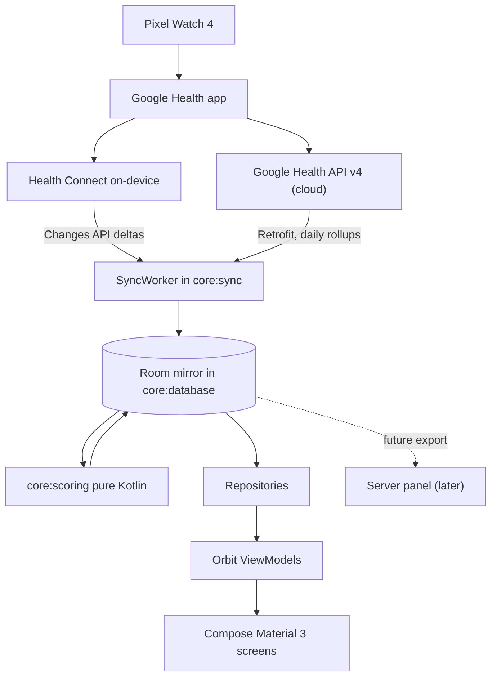

ём# Fitdroid: Sleep and Fitness Tracking MVP

## Context and constraints

The workspace is an empty git repo on `master` with no commits, so this is a clean greenfield build. The `android` CLI is installed (v1.0.15498356) and offers a single `empty-activity` template (Compose, AGP 9), which we use to establish the Gradle/AGP baseline and then restructure.

Three findings from research drive the design:

- **Health Connect alone is not enough.** The Google Health app writes sleep sessions with full stage breakdown, heart rate, resting heart rate, steps, exercise sessions, calories and distance to Health Connect — but deliberately withholds HRV, SpO2, respiratory rate and skin temperature. Those are only available from the cloud Google Health API.
- **Health Connect only reads 30 days back** unless the app holds `PERMISSION_READ_HEALTH_DATA_HISTORY`. Long-term baselines therefore require a local mirror, not read-through access.
- *All `googlehealth.` OAuth scopes are Restricted**, requiring Google's privacy and security review with no published SLA. The app must be fully functional on Health Connect alone while that review is pending.

## Data flow




Health Connect supplies sleep structure and activity; the Google Health API overlays the physiological metrics keyed by local date. Room is the single source of truth for the UI, which keeps every screen offline-capable and gives the future server panel a stable schema to export.

## Module structure

Composite build at `build-logic/` holding convention plugins, plus `gradle/libs.versions.toml` as the single version catalog. Convention plugins: `fitdroid.android.application`, `fitdroid.android.library`, `fitdroid.android.feature`, `fitdroid.android.compose`, `fitdroid.kotlin.library`, `fitdroid.metro`, `fitdroid.room`. This keeps every module's build file to a plugins block and a dependencies block.

Core modules:

- `:core:model` — pure Kotlin domain types (`SleepSession`, `SleepStage`, `DailyMetrics`, `ExerciseSession`, `SleepScore`, `ReadinessScore`). No Android dependencies.
- `:core:common` — `Result`/`AppError` wrappers, dispatcher providers, injected `Clock` and `ZoneId` so date-boundary logic is testable.
- `:core:designsystem` — Material 3 theme, colour and type tokens, and reusable visuals: score ring, hypnogram stage bar, sparkline, trend chip. Coil 3 image loader configured here.
- `:core:ui` — Compose glue: the Metro-backed `ViewModelProvider.Factory`, a `metroViewModel<T>()` helper, and formatters.
- `:core:health` — the Health Connect boundary. Wraps `HealthConnectClient`, exposes `getSdkStatus()` availability, the permission set, typed readers for `SleepSessionRecord`/`HeartRateRecord`/`RestingHeartRateRecord`/`StepsRecord`/`ExerciseSessionRecord`/`TotalCaloriesBurnedRecord`/`DistanceRecord`, and Changes API token handling.
- `:core:auth` — AppAuth-Android OAuth: authorization-code flow with PKCE via Custom Tabs, `AuthState` persisted in an encrypted store, refresh serialised behind a `Mutex`.
- `:core:network` — OkHttp + Retrofit + kotlinx.serialization against `health.googleapis.com/v4/`, an AIP-160 filter builder, and a pager over `nextPageToken`.
- `:core:database` — Room entities, DAOs, converters, migrations.
- `:core:datastore` — Preferences DataStore for Changes tokens, per-data-type sync watermarks, goals and settings.
- `:core:sync` — WorkManager orchestration with a Metro-injected `WorkerFactory`.
- `:core:scoring` — pure Kotlin scoring engine, no Android dependencies, exhaustively unit tested.
- `:core:testing` — fakes, fixtures, Orbit test helpers, in-memory Room rule.

Feature modules, each owning its Orbit ViewModel, state, side effects and Compose screen: `:feature:onboarding`, `:feature:dashboard`, `:feature:sleep-screen`, `:feature:activity-screen`, `:feature:reports`, `:feature:settings`.

`:app` holds the `Application`, the Metro `@DependencyGraph(AppScope::class)`, `MainActivity`, the navigation host, and the privacy-policy activity that Health Connect requires.

## Dependency injection with Metro

Apply `id("dev.zacsweers.metro") version "1.4.2"` through the `fitdroid.metro` convention plugin. Implementations in core modules annotate with `@ContributesBinding(AppScope::class)` so they aggregate into the app graph without the graph module depending on them directly:

```kotlin
@ContributesBinding(AppScope::class)
@Inject
@SingleIn(AppScope::class)
class HealthConnectSleepRepository(
    private val client: HealthConnectClient,
    private val dao: SleepDao,
) : SleepRepository
```

The app graph stays minimal:

```kotlin
@DependencyGraph(AppScope::class)
interface AppGraph {
    val viewModelFactory: ViewModelProvider.Factory
    val workerFactory: WorkerFactory
}
```

ViewModels contribute into a multibinding map via `@ContributesIntoMap(AppScope::class)` with a `@ViewModelKey`, which `:core:ui` reads to build the factory. ViewModels needing a `SavedStateHandle` use Metro's `@Assisted` support.

## UI state with Orbit MVI 12

Orbit 12 unified the container host API. Each ViewModel implements `OrbitContainerHost<Internal, External, SideEffect>`. The sleep screen is the natural place to use the internal/external split: internal state holds raw sessions and baselines, external state holds only what the UI renders.

```kotlin
class SleepViewModel(
    private val repository: SleepRepository,
) : ViewModel(), OrbitContainerHost<SleepState, SleepUiState, SleepEffect> {
    override val container = orbitContainer(SleepState(), ::toUiState)

    fun selectNight(date: LocalDate) = intent {
        reduce { state.copy(selectedDate = date) }
    }
}
```

Screens consume it with `collectAsState()` and `collectSideEffect {}` from `orbit-compose`. Simpler screens use `OrbitContainerHost<S, S, E>` with the same type twice.

## Synchronisation

A `PeriodicWorkRequest` (roughly hourly, plus a manual pull-to-refresh trigger) runs two coordinated passes.

The **Health Connect pass** uses the Changes API for deltas: fetch a token with `getChangesToken(ChangesTokenRequest(recordTypes))`, page through `getChanges(token)`, and persist the new token to DataStore. Room stores each Health Connect record `id`, because `DeletionChange` notifications only carry the id. An expired token triggers a bounded full resync. Reading while backgrounded needs `PERMISSION_READ_HEALTH_DATA_IN_BACKGROUND`, gated behind a `getFeatureStatus(FEATURE_READ_HEALTH_DATA_IN_BACKGROUND)` check; the initial deep backfill needs `PERMISSION_READ_HEALTH_DATA_HISTORY`.

The **Google Health API pass** pulls the daily physiological types the watch reports after each night — `daily-heart-rate-variability`, `daily-oxygen-saturation`, `daily-respiratory-rate`, `daily-resting-heart-rate`, `daily-sleep-temperature-derivations`, `respiratory-rate-sleep-summary` — using `:list` with AIP-160 filters and a per-type watermark:

```kotlin
@GET("v4/users/me/dataTypes/{type}/dataPoints")
suspend fun listDataPoints(
    @Path("type") type: String,
    @Query("filter") filter: String,
    @Query("pageSize") pageSize: Int = 1000,
    @Query("pageToken") pageToken: String? = null,
): DataPointsResponse
```

Filter grammar varies by data kind: `Daily` types filter on `{type}.date`, `Session` types on `{type}.interval.end_time`, `Sample` types on `{type}.sample_time.physical_time`, `Interval` types on `{type}.interval.start_time`. The filter builder in `:core:network` encodes this so callers cannot get it wrong.

Six data types reject `:list` entirely (`floors`, `total-calories`, `active-minutes`, `calories-in-heart-rate-zone`, `time-in-heart-rate-zone`, `daily-heart-rate-zones`) and need rollup variants — none are MVP-critical, but the client should fail loudly rather than silently.

## OAuth

Register an Android OAuth client in a Google Cloud project — public client, no secret, PKCE. AppAuth handles the code verifier and challenge, opening Custom Tabs with `RedirectUriReceiverActivity` catching a reverse-DNS custom scheme redirect. Request `access_type=offline` and only these scopes:

- `https://www.googleapis.com/auth/googlehealth.sleep.readonly`
- `https://www.googleapis.com/auth/googlehealth.health_metrics_and_measurements.readonly`
- `https://www.googleapis.com/auth/googlehealth.activity_and_fitness.readonly`

Critically, do **not** pass `include_granted_scopes=true`. If legacy `fitness.`* scopes ever get unioned into the token, the Google Health data plane rejects it with an opaque 403 while profile reads keep working. Also skip `prompt=consent` unless needed.

Token refresh goes through `AuthState.performActionWithFreshTokens` behind a `Mutex` to stop concurrent workers racing on a rotating refresh token, with an OkHttp `Authenticator` handling 401s. Confirm linkage against `users/me/identity` before trusting any data read. Keep the whole Google Health integration behind a remote-off-by-default flag so the app ships useful on Health Connect alone while the Restricted-scope review is outstanding.

## Scoring engine

`:core:scoring` is pure Kotlin with injected `Clock`, making it trivially testable and directly portable to the future server.

- **Sleep score** — weighted composite of duration against target, restorative fraction (deep + REM as a share of asleep time), efficiency (asleep over time in bed), disturbance count from awake segments, and schedule consistency measured as bedtime variance against a rolling 14-day baseline.
- **Readiness score** — HRV expressed as a z-score against a 30-day rolling baseline, resting heart rate deviation, previous night's sleep score, and training load via an acute-to-chronic workload ratio over exercise minutes. Degrades gracefully to an RHR-and-sleep-only model when Google Health API data is unavailable, which is what makes the Health-Connect-only path viable.
- **Activity score** — steps against goal, active minutes, and cardio load from heart-rate zone time.

Every score persists alongside a component breakdown so the UI can explain *why* a score moved, which is the main thing Fitbit Premium charges for. Scores are recomputed after each sync and stored in a `scores` table.

## Room schema

Tables: `sleep_sessions` (with `hcRecordId`, `hcLastModified`), `sleep_stages`, `daily_metrics` (date-keyed: RHR, HRV, SpO2, respiratory rate, skin temp deviation, steps, calories, distance, exercise minutes), `exercise_sessions`, `heart_rate_samples` (downsampled — the API returns roughly 5-second resolution, about 8,700 samples per day, so store aggregates plus sleep-window detail rather than everything), `scores`, and `sync_state`. Entities are designed as the eventual server export schema so the later panel needs no migration.

## Platform targets

`minSdk = 34` so Health Connect is always the Android framework module, removing the APK-provider install path and update prompts entirely. `targetSdk` at whatever the AGP 9 template scaffolds. Health Connect SDK at `androidx.health.connect:connect-client:1.2.0-alpha04`, with `connect-testing` for fakes.

## Deliberately out of scope for MVP

No Wear OS companion module, no server, no writes back to Health Connect or the Google Health API (write scopes are not granted to third-party clients yet anyway), no medical records, no nutrition.

## Verification

Build with `./gradlew assembleDebug`, then deploy and exercise on the Pixel via `android run` and `android layout` for UI inspection. Health Connect flows are testable without real watch data using the Health Connect Toolbox to inject sleep sessions.
